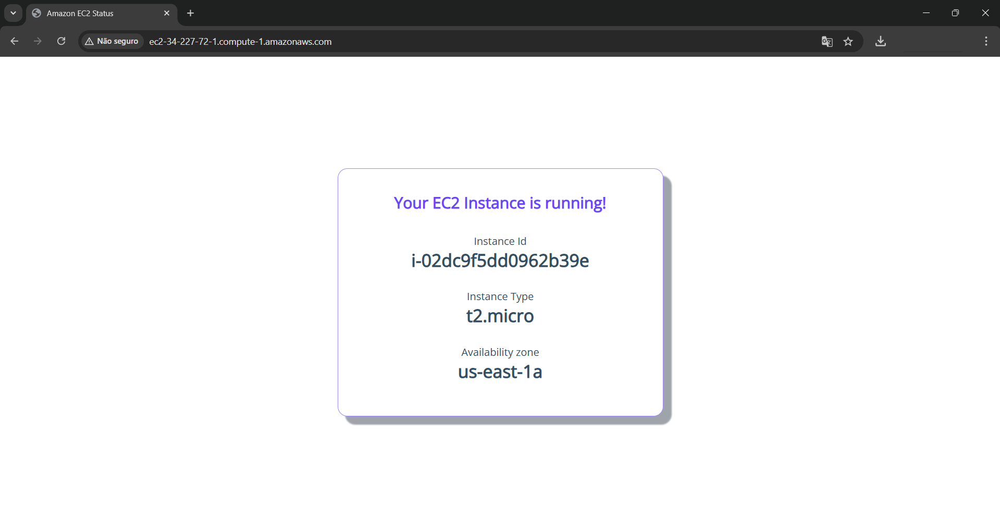

# Cloud First Steps - EC2 🌥️🚀

Esse projeto é parte de uma jornada de aprendizado na AWS (Amazon Web Services)! O objetivo é explorar e usar o Amazon EC2 para criar e configurar instâncias em múltiplas zonas de disponibilidade. Vamos lá? 😎

---

## 🏁 O que você vai aprender:

- **Benefícios da infraestrutura da AWS** 🌍
- **O que são Regiões e Zonas de Disponibilidade na AWS** 🌐
- **Como lançar instâncias EC2 em várias zonas de disponibilidade** 💻

---

## 🔧 Passo a passo

### 1️⃣ Iniciando o Lab

1. **Revisar os objetivos do lab** no **Concept Section** 📖.
2. Clique em **Start Lab** ou **Open AWS Console** para começar 🖱️.
3. **Siga as instruções do lab** para navegar pelos passos ➡️.

---

### 2️⃣ Baixando Arquivos

1. Na página do lab, clique na aba **Lab Files** 📂.
2. Clique no ícone de **download** para salvar o arquivo **user-data** no seu dispositivo 💾.
3. Clique na aba **Steps** para voltar aos passos do lab 🔄.

---

### 3️⃣ Configurando a Região e EC2

1. **Verifique a Região selecionada** no topo da página, e ajuste para **N. Virginia (us-east-1)** 🌎.
2. No campo de pesquisa de **Serviços**, digite `ec2` e clique em **EC2** 🔍.

---

### 4️⃣ Lançando a Instância EC2

1. No painel à esquerda, clique em **EC2 Dashboard** 📊.
2. Na seção **Launch instance**, clique em **Launch instance** 🚀.

---

### 5️⃣ Definindo o Nome e Imagem

1. Na seção **Name and tags**, coloque o nome da sua instância (ex: `webserver01`) 🏷️.
2. Em **Application and OS images**, escolha **Amazon Linux** 🐧.

---

### 6️⃣ Escolhendo a Imagem da Instância

1. No dropdown de **Amazon Machine Image (AMI)**, escolha **Amazon Linux 2 AMI (HVM)** (importante!) 🖼️.
2. Selecione o tipo de instância **t2.micro** 💡.
3. Continue para a próxima etapa 👇.

---

### 7️⃣ Configurações de Segurança

1. **Key Pair**: Escolha **Proceed without a key pair** (não se esqueça de que não precisaremos de chave para esse exercício) 🔑.
2. Em **Network settings**, clique em **Edit** 🛠️.

---

### 8️⃣ VPC e Subnet

1. Selecione a VPC chamada **LabVpc** (essa é a correta!) 🌐.
2. Escolha a subnet **us-east-1a** para a zona de disponibilidade (lembre-se que em um próximo passo, você precisará escolher a zona de outra AZ) 🔀.

---

### 9️⃣ Configurando o Grupo de Segurança

1. Dê o nome **Security-Group-Lab** e descreva como **HTTP Security Group** 🔒.
2. Escolha o tipo **HTTP** para permitir acesso via porta 80 🌐.

---

### 🔟 Armazenamento e Avançado

1. Em **Configure storage**, escolha **gp2** para o volume raiz 💾.
2. Expanda as **Advanced details** e prossiga 🔽.

---

### 1️⃣1️⃣ Usando o Arquivo User-Data

1. Abra o arquivo **user-data** que você baixou anteriormente 🔑.
2. O script contido nele configura um servidor web com informações sobre a instância 🖥️.

---

### 1️⃣2️⃣ Carregando o User-Data

1. No repositório, baixe o arquivo **user-data** 📂.
2. Selecione o arquivo **user-data** e insira-o como **User Data** ao executar a instância.

---

### 1️⃣3️⃣ Revisando os Detalhes

1. Verifique o conteúdo do **User Data** para garantir que está correto ✅.

---

### 1️⃣4️⃣ Revisão Final e Lançamento

1. Confira a seção **Summary** para garantir que a **Amazon Linux 2 AMI** foi selecionada ✅.
2. Clique em **Launch instance** 🚀.

---

### 1️⃣5️⃣ Confirmando o Sucesso

1. Confira a mensagem de sucesso após o lançamento ✅.
2. Role até o fim da página para continuar 👇.

---

### 1️⃣6️⃣ Visualizando Instâncias

1. Clique em **View all instances** para ver sua instância 🧐.

---

### 1️⃣7️⃣ Verificando o Status

1. Selecione a instância e verifique se está com o estado **Running** ✅.
2. Copie o **Public IPv4 DNS** (não use o link “open address”) 📋.

---

### 1️⃣8️⃣ Testando a Instância

1. Em uma nova aba, cole o **DNS público** no navegador e veja os detalhes da sua instância na página gerada 📄.
2. Se aparecer uma página de erro, **verifique se o endereço começa com http** (não https) 🔒.

---

### 1️⃣9️⃣ Parabéns! 🎉

Você terminou a parte prática do lab! Agora, é só seguir para a seção DIY para concluir a solução e fazer o exercício de forma independente! 😄

---

## 🚀 Vamos em frente!

Agora que você entendeu os conceitos e implementou a solução, continue sua jornada no mundo da nuvem! ☁️✨
